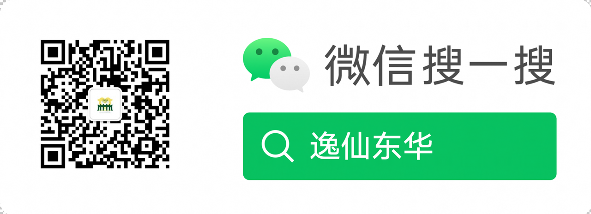
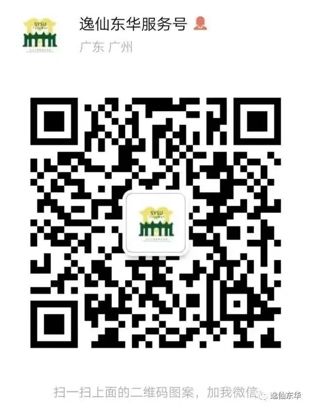
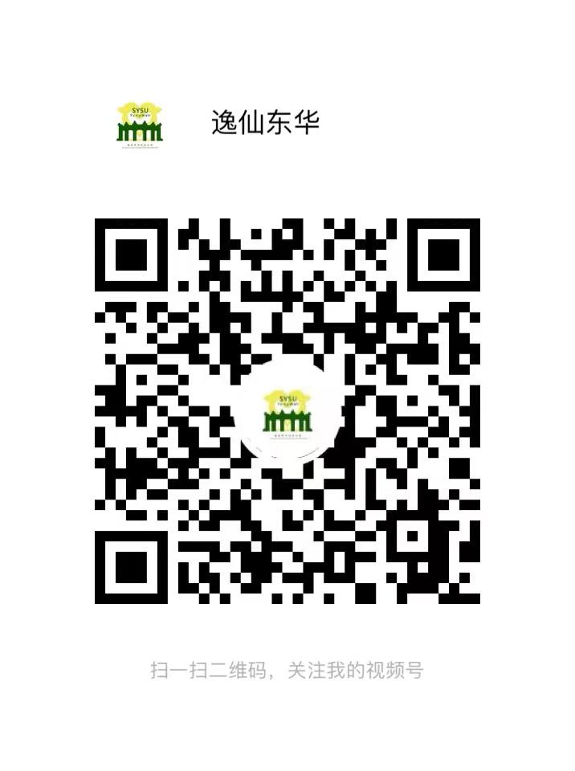

# 东华高级中学校友会中大分会手册

东华高级中学校友会中大分会（逸仙东华）是毕业于东华高级中学的中山大学校友自发筹建、运营的公益校友组织，已服务超过四届、近一千位校友，倾力为校友、高考考生和家长提供专业、学业、职业一体化、全链条支持。小组恪守中山大学“博学、审问、慎思、明辨、笃行”的校训，也将东华高中“心止于善，行止于美”的谆谆教导长存心间，在两所母校的共同期待下，坚定为校友服务的初心与使命，凝聚数千校友伟力，迈向更辽阔天地。 

    
     
    

      公众号
  	

    
     
    

      服务号
  	

    
     
    

      视频号
  	

